# Node.js前后端登陆接口

## 通用组件部分

### 数据定义

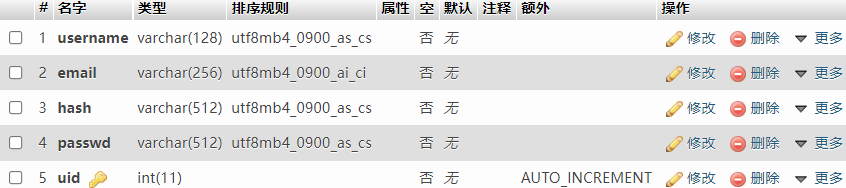

- `username`：用户名；
- `email`：邮件；
- `hash`：密码加盐的盐值；
- `passwd`：加密后的密码；
- `uid`：数据表主键，用于唯一标识一个用户；

我们约定，用户名是不可以重复的，但是邮箱是可以重复的。约束放在后端来做。除了邮箱以外，其他的字符串类型的数据都是严格区分大小写的。

在YDJSIR提供的导出的数据库文件中，已经包含了三个账户，用户名分别是`ss1`，`ss2`，`ss3`，密码都是`ssss1111`。数据库转移文件是`base_info.sql`。

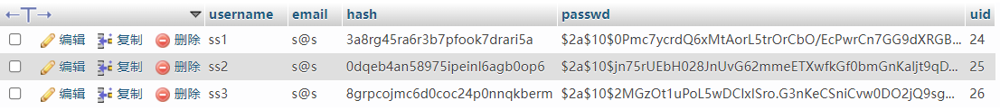

### 数据库

为了便于开发和调试，YDJSIR选择了在docker中启动`MySQL`（数据库）和`phpMyAdmin`（面板）服务。启动过程如下所示，十分简洁明了。提交文件中附有转移数据表使用的`SQL`脚本文件，可轻松迁移到其他平台。

```bash
docker pull mysql:8.0.1
docker run --name YDJSIR-mysql -p 3307:3306 -e MYSQL_ROOT_PASSWORD=<数据库密码> -d mysql:8.0.1
docker pull phpmyadmin/phpmyadmin:latest
docker run --name YDSJIR-phpmyadmin -d --link YDJSIR-mysql:db -p 5601:80 phpmyadmin/phpmyadmin
```

### 验证码

验证码使用了这个仓库的实现。

https://github.com/produck/svg-captcha/

验证码图片由后端生成，然后发送给前端。前端在每一次提交登录/注册请求时会把绑定到当前会话的验证码带上，由后端进行校验，以确保安全性。

前端部分对应代码如下。（每次验证码出现都是类似的，不再赘述）

```javascript
function getCaptcha() {
  $.ajax({
    method: "GET",
    xhrFields: { withCredentials: true },
    url: "http://localhost:3001/getcaptcha",
    data: {},
  }).done(function (data, status) {
    console.log(status);
    if (status == "success") {
      const captcha = document.getElementById("captchaPic");
      captcha.innerHTML = data;
      console.log(captcha);
    }
  });
}
```

补充说明一下，这个`captcha`元素在初始状态长这样。实际上整个`<div>`标签在点击时都会触发验证码刷新。

```html
<div id="captchaPic" class="input-addon" style="float: left">
    <button
            class="button-link"
            style="margin: auto; color: aliceblue"
            id="getcaptchapic"
            >
        点击获取
    </button>
</div>
```

后端部分对应如下。

```javascript
// 验证码请求接口，在前端加载页面或手动触发时会请求
app.get("/getcaptcha", (req, res) => {
  const captcha = svgCaptcha.create({
    noise: 3, // 干扰线条的数量
    background: "#50ff33", // 背景颜色
    width: "100",
    height: "40",
  });
  // 将图片的验证码存入到 session 中
  req.session.img_code = captcha.text.toLocaleUpperCase(); // 验证码不区分大小写，存储统一大写
  res.type("html"); // 注意这里的类型设置为HTML，与前端直接把返回体作为HTML代码嵌入网页中相对应
  res.send(String(captcha.data));
  res.status(200);
});
// 下面是在处理登录注册请求时的校验过程，以登录过程为例
const { username, password, captcha } = req.body;
console.log(req.session.img_code);
console.log("Client Captcha: " + captcha);
if (captcha.toLocaleUpperCase() != req.session.img_code) {
    console.log("ERROR: captcha wrong!");
    res.send({ RESULT: invalid_captcha }); // 向客户端报告这个错误，并不做进一步的处理
    return;
}
```

### 跨域问题

为了解决所有的跨域问题，特别是带上了`express-session`后的跨域问题，如下设置。

前端的每次请求都会带上如下内容，以保证能在`cookie`中保存会话相关信息并在请求时能带上会话信息。

```javascript
xhrFields: { withCredentials: true }
```

后端明确指出了前端的来源`refer`，因此启动前端时请注意默认情况是让前端跑在80端口，且跑在同一台机器上（两边都是`localhost`）。如果修改了这样的设置，会因为跨域引起失败。

```javascript
// 所有请求开始之前
app.use(
  session({
    secret: SECRET,
    resave: false,
    cookie: {
      domain: "localhost:" + PORT,
      maxAge: 600000,
    },
    saveUninitialized: true,
    cookie: { secure: false }, // 为了兼容性设置
  })
);
// 解决跨域问题
app.all("*", function (req, res, next) {
  res.header("Access-Control-Allow-Origin", "http://localhost"); // 明确指出了前端的地址
  res.header("Access-Control-Allow-Headers", "X-Requested-With");
  res.header("Access-Control-Allow-Credentials", "true"); // 否则请求时候带不上会话相关信息
  res.header("Access-Control-Allow-Methods", "PUT,POST,GET,DELETE,OPTIONS");
  res.header("X-Powered-By", " 3.2.1");
  res.header("Content-Type", "application/json;charset=utf-8");
  next();
});
```

## 前端部分

### 概述

前端部分沿用了第一次作业的大体设计，但是增加了新的重复密码框，并使用CDN引入`jQuery`与后端进行通信。除此以外显然引入了大量JavaScript以实现功能。前端界面具有适配多种平台的能力，在`Chrome 91`开发者工具所提供的所有类型的设备的模拟屏幕种均能完整显示正常操作。

运行前端时应尽量保证它在一个服务器环境中运行。本人采用的是`nginx-1.16.1`。监听的端口应设为80，正如前文提及的跨域设置中那样。

### 登录部分

#### 数据校验

用户名和密码都不能为空，否则拒绝提交并提示用户输入。

#### 登陆成功

如果登陆成功，会弹窗提示，点击确认后跳转到首页。

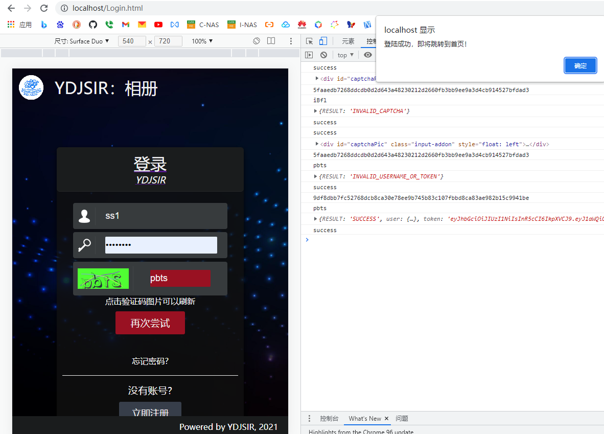

登陆成功时后端会向前端发送`Token`。这是用户登陆状态的证明，

#### 登陆失败

登陆失败有两种情况。

用户名和密码不匹配时，会做如下提示，并允许用户在点击确认后重新输入。

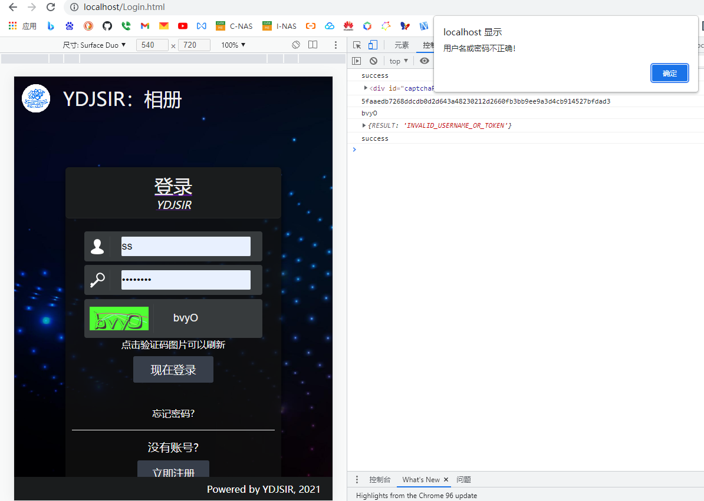

验证码错误时，无论账号密码是否正确，会做如下提示，并允许用户重新输入。

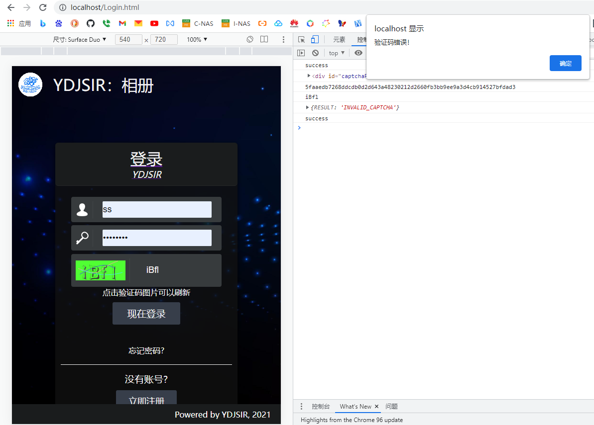

#### 密码安全性

前端向后端发送请求的时候即已经密码加盐（用户名）并用SHA-256散列，服务端不接触明文密码。SHA-256的实现使用的是这个仓库，下同。

https://github.com/brillout/forge-sha256

```javascript
var oripwd = password.value;
var encryptedpassword = forge_sha256(username.value + oripwd);
```

### 注册部分

#### 数据校验

所有的项目均为必填项目，包括必须勾选已经阅读隐私协议（不勾选提交会弹窗警告）。

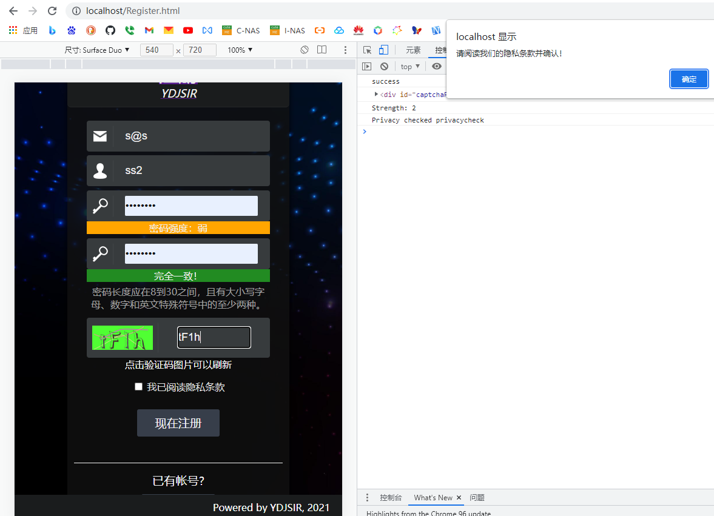

如有缺漏，前端会从上到下检测，并给出对应的提示。邮件一栏使用了HTML5自带的`email`类型。

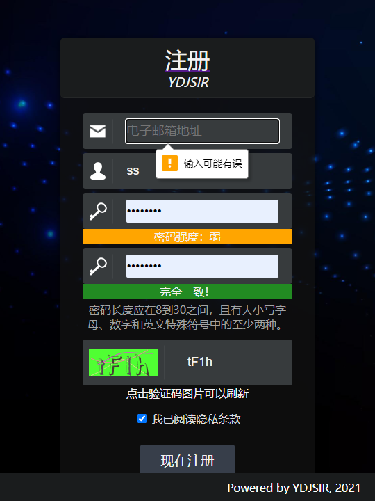

本项目通过监听密码框和确认密码框的输入事件实现以下功能：

1. 密码强度把关；
2. 确认密码框和密码框内容保持一致；

##### 密码强度把关

本项目基本密码强度要求是密码长度应在8到30之间，且有大小写字母、数字和英文特殊符号中的至少两种。

如不符合任意一项，密码复杂度置为0。密码将从长度（8-14：1分；15-19：2分；20-30：3分）和字符类型丰富度（每多一种字符加一分）两方面打分，并根据得分提示密码强度（3分-弱；4分-中；5分-强；6分-极强；7分：固若金汤）。提示内容的背景颜色会随之变化。

##### 确认密码框和密码框内容保持一致

当且仅当确认密码框和密码框内容保持一致且密码本身符合强度要求规定时，提示“完全一致”并允许注册。否则，对应显示“密码不符合要求”或“两次输入的密码不一致”。提示内容的背景颜色会随之变化。

| 密码不符合要求                                               | 两次输入密码不一致                                           |                                              |
| ------------------------------------------------------------ | ------------------------------------------------------------ | -------------------------------------------- |
| 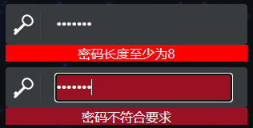 | 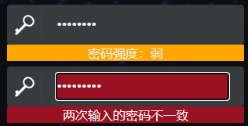 | 完全一致且两次输入密码内容一致的情况看上张图 |

#### 注册成功

如果该用户名从未被占用，且密码强度符合要求，则允许注册。

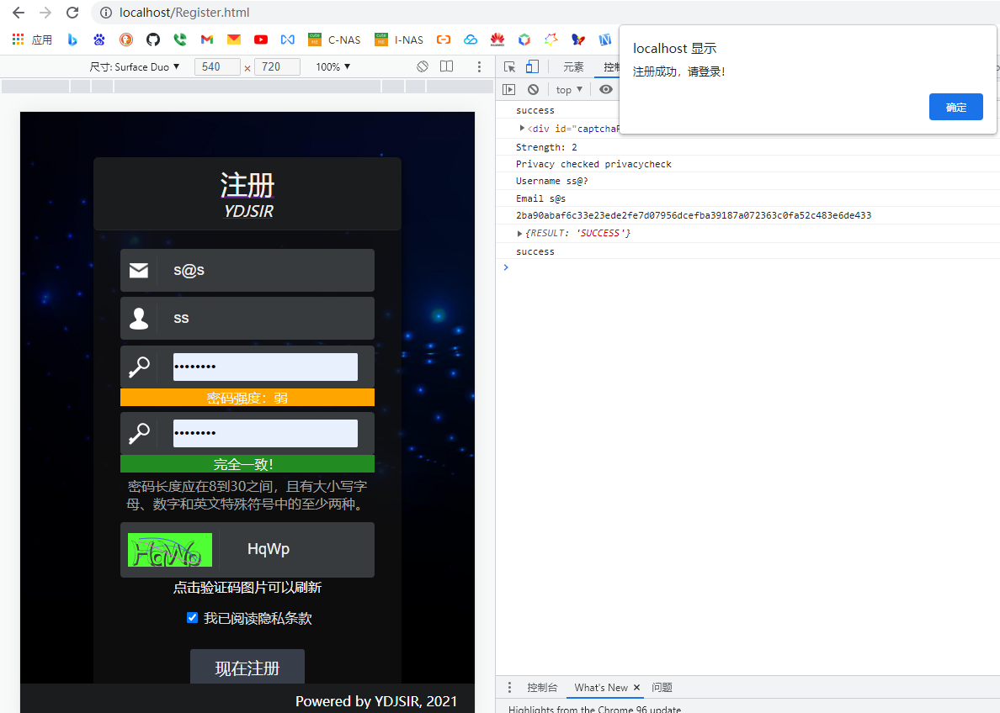

#### 注册失败

如果用户名被占用，会提示用户名被占用，并指引用户进行修改。

（报错是因为忘了开后端）

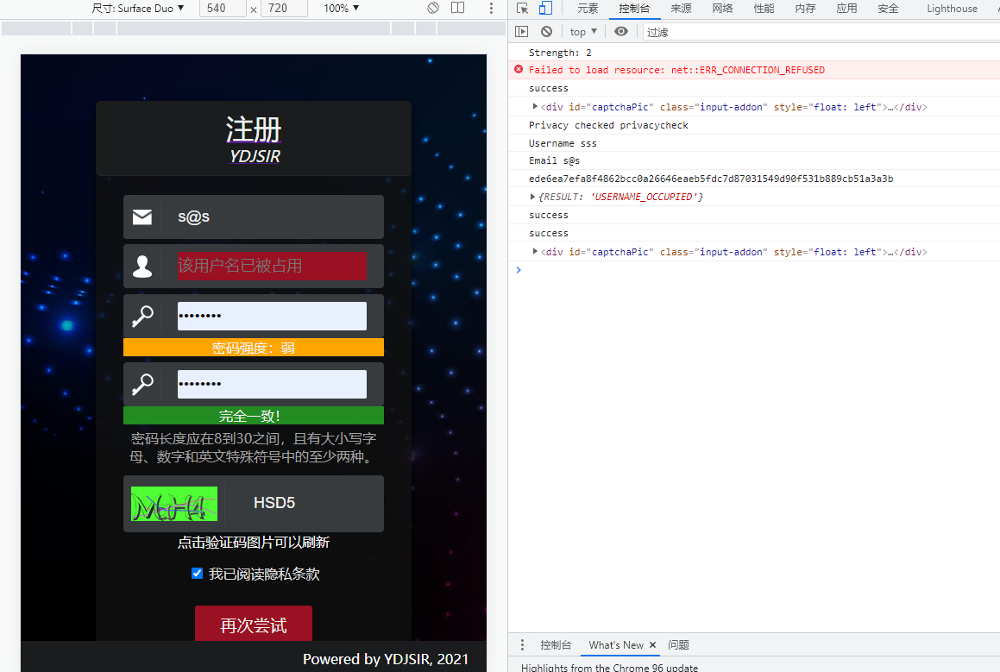

#### 密码安全性

前端在向后端发送请求时会做和登录侧一样的处理，在此不再赘述。

## 后端部分

### 概述

后端采用了`Node.js`和`express`框架。依赖的`npm`包如下。

- `express`
- `express-session`
- `mysql`
- `body-parser`
- `jsonwebtoken`
- `bcryptjs`
- `csprng`

`package.json`已经编写好，直接`npm install`即可。

### 数据库连接部分

```javascript
const con = mysql.createConnection({
  host: <主机名>,
  user: "root",
  password: <数据库密码>,
  port: 3307,
  database: <数据库名>,
});

// 定义一个执行 sql 语句的函数 并且返回一个 promise 对象
const exec = (sql) => {
  const promise = new Promise((resolve, reject) => {
    con.query(sql, (err, result) => {
      resolve(result);
    });
  });
  return promise;
};
// 连接数据库
con.connect();
```

以后每次调用数据库都是通过如下过程进行。

```javascript
const sql0 = <SQL语句>;
exec(sql0).then((result) => {});
```

### 密码安全性

#### 登录部分

登录流程在前端已描述，在此不再重复。

在密码匹配时，会从数据库取出盐值并加上客户端发来的输入哈希后和数据库中存储的密码进行匹配，并向客户端返回结果。

```javascript
// user是从数据库查询结果中返回的对象
const salt = user.hash;
const isPasswordValid = bcrypt.compareSync(salt + password, user.passwd);
```

注意到在登陆后向前端返回的user对象中的`passwd`和`hash`项都是空的。客户端只能持有一个临时性的`TOKEN`以保证安全。

#### 注册部分

注册流程在前端已描述，在此不再重复。

在向数据库存储密码时，会利用`csprng`生成随机的盐值，加上客户端发来的SHA-256后的密码再用`bcrypt`做哈希，并将盐值和哈希值存入数据库中。服务端全程不接触明文密码，杜绝从服务端泄露原始密码的可能。

下面代码仅作示意，实现时有改动。

```javascript
const oripasswd = req.body.password;
const salt = rand(128, 28); // 基于csprng生成的随机字符串
const password = bcrypt.hashSync(salt + oripasswd, 10);
```

