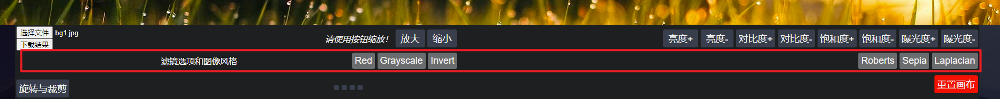
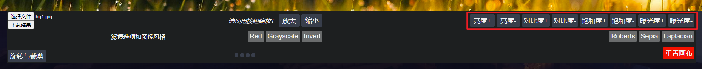
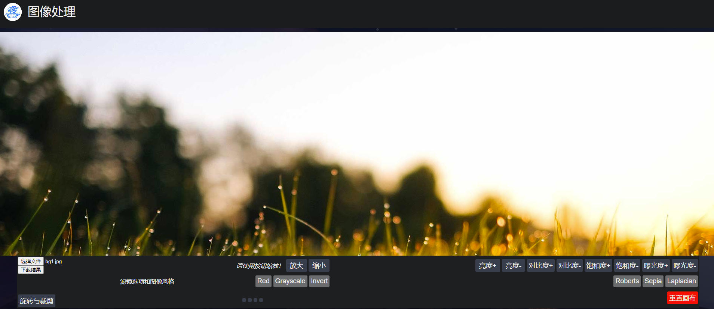
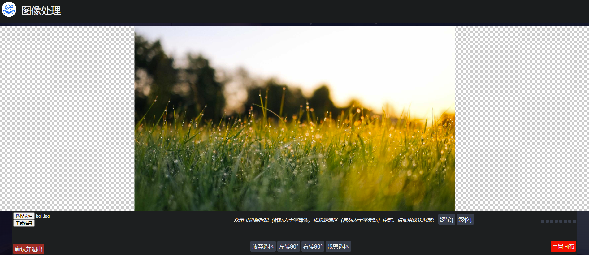
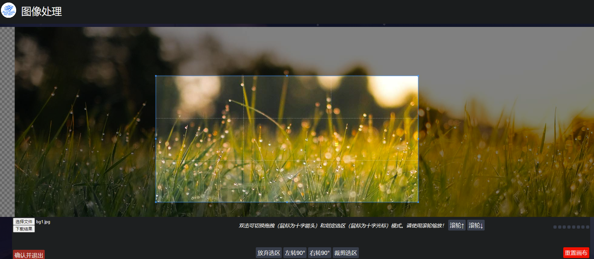

# 前端图像处理实践

## 实现功能

本作业实现了以下所有功能。

1. 滤镜功能，可以选择一组预设滤镜；

2. 手动更改属性（例如亮度，对比度，饱和度）以获得所需的结果；

3. 裁剪、旋转和缩放图像；

4. 图像风格迁移；

## 代码说明

本项目全部使用了本地缓存的`CSS`和`JavaScript`，没有使用`Node.js`或`CDN`。

直接双击打开`index.html`会有跨域问题。请保证访问时网页放在一个HTTP服务器中。我采用的是`nginx-1.16.1`。

选项区左上角可以上传待修改的图片或下载画布的内容（格式为`png`）。

### 滤镜与图像风格迁移

本项目使用的是`Lena.js`。仓库地址：https://github.com/davidsonfellipe/lena.js



左侧的是三种滤镜，红色，灰度与反色，而右侧是三种图像风格。代码调用部分十分简单，举一个例子。

```javascript
fliter1.addEventListener("click", (event) => {
  if (!hasPic) {
    alert("请先上传需要操作的图片！");
    return;
  } else {
    var filter = LenaJS["red"];
    // img.src = imgSrc;
    LenaJS.filterImage(canvas, filter, img);
    imgSrc = canvas.toDataURL();
  }
});
```

这一栏会在旋转与裁剪模式下被隐藏。

### 手动更改属性

本项目使用的是`caman.js`。仓库地址：https://github.com/fengyuanchen/cropperjs

点击对应的按钮会触发对应的效果，可以调整亮度、对比度、饱和度和曝光度。



代码调用部分也十分简单，举一个例子。

```javascript
lightUp.addEventListener("click", (event) => {
  if (!hasPic) {
    alert("请先上传需要操作的图片！");
    return;
  }
  console.log("lightUp");
  Caman("#banner", function () {
    this.brightness(5).render(function () {
      imgSrc = this.toBase64();
    });
  });
});
```

### 裁剪、旋转与缩放图像

在非旋转与裁剪模式下，缩放通过第一行中间的按钮进行。在旋转与裁剪下，这两个按钮不可用。

裁剪、旋转与缩放图像功能在旋转与裁剪模式下可用。点击左下角`旋转与裁剪`进入该模式。

本项目使用的是`copper.js`。仓库地址：https://github.com/meltingice/CamanJS





使用鼠标滚轮可以缩放图片。进入时默认是拖拽裁切模式（选定选区），光标呈十字。双击非选区可以将模式切换为移动模式，即选区对屏幕不动，图片移动（无论是否有选区）。选区的边缘可以随意调整。



点击`放弃选区`，可以取消选区并不做任何更改。点击`裁剪选区`会裁剪出对应区域。如果操作结束，点击右下角`确认并退出`可以返回一般模式（有选区的情况下必须放弃选区或者裁剪选区才能退出）。点击`左转90°`和`右转90°`可以旋转图片。

详情请见代码部分。