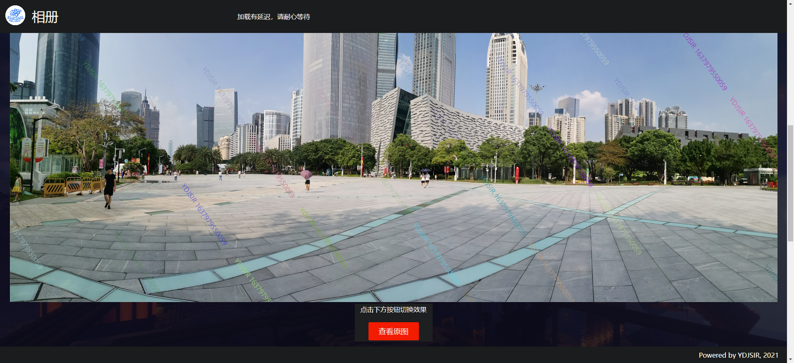
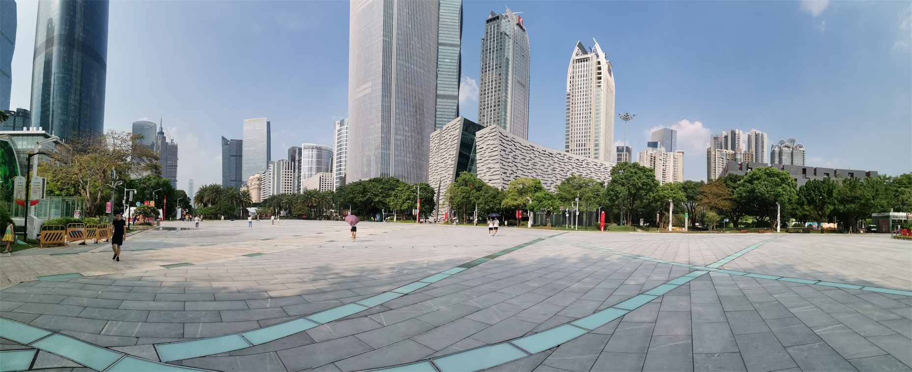
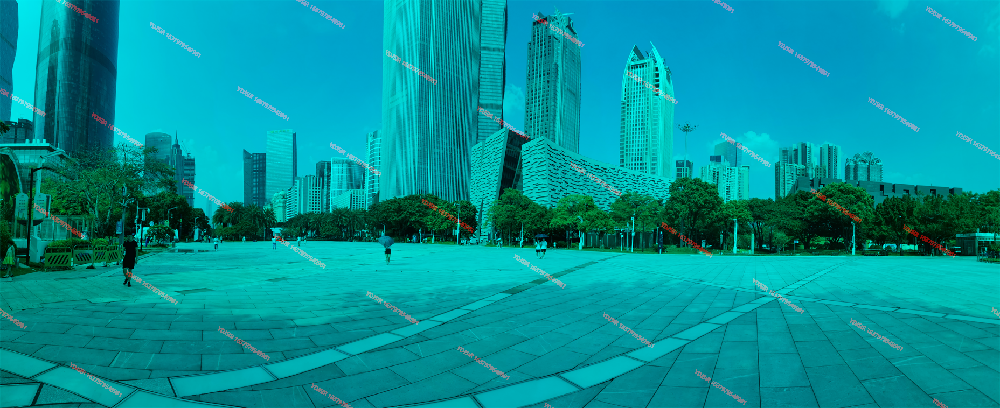

# 前端水印实践

## 使用说明

- 本次实践基于第一次作业的框架完成，且没有采用第三方库，网站可以在`Chrome 91`、`Firefox 91`和新`Edge`中正常打开；

- 由于直接打开会有跨域请求相关问题，==请不要直接双击打开`html`文件，而是将文件置于HTTP服务器环境下用浏览器打开==。开发时使用的是`nginx-1.16.1`；

- 效果的刷新可能有一定延迟，请不要操作过快；

- 代码中有详细注释；

- 项目文件结构如下图所示：

  ```
  /
  │  detailed.html
  │  icon.ico
  │  README.md
  │
  ├─css
  │      common.css
  │      index.css
  │
  ├─img
  │      banner.png
  │
  ├─js
  │      canvas-invisible.js
  │      canvas-visible.js
  │
  └─README.assets
          可见水印.png
          不可见水印.png
          查看水印.png
  ```
  
  
  
  

## 实现过程

本次实验中所有的水印均为`YDJSIR` 和当前UNIX时间戳，字体为微软雅黑，字号为16px。 

### 可见水印

可见水印的实现过程参考了https://cloud.tencent.com/developer/article/1158636。

整体的实现流程是新建一个`canvas`画布，在画布中绘制对应图片后，再在上面用`canvas`绘制倾斜角度随机，颜色随机且有随机抖动角度的半透明水印矩阵。绘制完成后，把原HTML文件中的图片源换为`canvas`的结果。

在展示有水印的图片时，点击该展示区域中的按钮，可以查看原图，而后按钮提示变为`可见水印`，再次点击则再次生成带水印的图片。由于水印的倾斜角度是随机的，所以每一次重新添加水印水印的位置都会改变。



绘制部分核心代码如下。

```javascript
// 绘制水印
ctx.textAlign = textAlign;
ctx.textBaseline = textBaseline;
ctx.font = font;

// 围绕中心点旋转随机角度作为初始倾斜角度
ctx.translate(img.width / 2, img.height / 2);
ctx.rotate(Math.random() * 90 * Math.PI / 180);     // 旋转

rowNum = img.width / step;
lineNum = img.height / step;
Num = Math.max(rowNum, lineNum);                    // 取长边
shuffle = 0;                                        // 抖动角度
var myDate = new Date();

for (let i = 0; i < Num; i++) {
    for (let j = 0; j < Num; j++) {
        // 随机颜色，且确保透明度不超过50%
        ctx.fillStyle = "rgba(" + (Math.random() * 256) + ", " + (Math.random() * 256) + ", " + (Math.random() * 256) + ", " + Math.random() * 0.7 + ")";
        // 线列加水印，内容是当前用户和UNIX时间戳
        ctx.fillText(content + " " + myDate.getTime(), step * (i - Num / 2), step * (j - Num / 2));
    }
    ctx.rotate(-shuffle * 5 * Math.PI / 180);       // 随机旋转角度
    shuffle = Math.random();
    ctx.rotate(shuffle * 5 * Math.PI / 180);        // 还原
} 
```

不可见水印部分的绘制代码也是类似的，只不过绘制时没有随机颜色，`fillStyle = "rgba(255, 255, 255, 1)"`，下面不再赘述。

### 不可见水印

不可见水印的实现过程参考了http://www.alloyteam.com/2016/03/image-steganography/。

#### 添加水印

整体的实现流程是在一个大小和对应图片相同的`canvas`画布中先绘制对应水印获得其图像数据后，重置画布，绘制对应图片并获得原始图片的图像数据。同时逐个遍历两组数据中的每一个像素，将原始图片中水印中有内容的点的通道的值置为偶数，水印中没有内容的点的通道的值置为奇数。将这样的图像数据重新绘制，便可得到带有隐式数字水印的图片。下面这张图便是带有隐式水印的。原图附在压缩包中。



实现部分的核心代码如下。

```javascript
function encodeImg(src, id, color) {
    /* 初始化部分已略去*/
img.onload = function () {
       /* 初始化和水印绘制部分略去 */
    	// 获取水印数据
        textData = ctx.getImageData(0, 0, ctx.canvas.width, ctx.canvas.height);
        canvas.width = img.width;   // 重置画布
        canvas.height = img.height;
        ctx.drawImage(img, 0, 0);
    	// 获取图片数据
        originalData = ctx.getImageData(0, 0, ctx.canvas.width, ctx.canvas.height); 
        mergeData(ctx, color, textData, originalData);// 选择特定通道，进行混合与绘制
    };
}
```

```javascript
function mergeData(ctx, color, watermarkData, originalData) {
    var oData = originalData.data;
    var newData = watermarkData.data;
    var bit, offset;                                    // bit的作用是找到对应通道，其实就是模4取余后的余数，offset指向的是alpha通道距离当前通道的偏移量
    offset = getOffset(color);
    bit = 3 - offset;
    console.log("Total number of pixels: " + oData.length / 4);

    var bitProcessed = 0;   // 计算到底处理了多少个像素点

    // 像素遍历，添加信息
    for (var i = 0; i < oData.length; i++) {
        if (i % 4 == bit) {
            // 只处理目标通道
            if (newData[i + offset] !== 0 && oData[i] % 2 !== 0) {          // 奇数情形且对应的位点有信息
                if (oData[i] === 255) {
                    oData[i]--;
                } else {
                    oData[i]++;
                }
                bitProcessed += 1;
            }
            else if (newData[i + offset] === 0 && oData[i] % 2 === 0) {     // 偶数情形且对应的位点没有信息
                oData[i]++;
                // 反正破不了255
            }
            // 偶数情形且有信息/奇数情形且没有信息：不管不顾就好
        }
    }
};
```


#### 查看水印

想要查看水印，只需要将`canvas`中的图像数据读出，选择其中特定通道为偶数的点，将该通道拉满，反之将其降为0，其他点的其他通道可以选择性关闭（当然下图是没有关闭的效果，不影响），再重新绘制，便可看到类似下方的效果。

这张图是与上面的那张图相对应的解码后的结果。原图附在压缩包中。

在有隐式水印的情况下，点击图片下方按钮可查看如下图所示的水印解码结果，再点一次则刷新为原图，再点一次则又会添加隐式水印并回到一开始的状态。



核心实现代码如下。

```javascript
function decodeImg(id, color) {
    var ctx = document.getElementById(id).getContext("2d");
    var encodedData = ctx.getImageData(0, 0, ctx.canvas.width, ctx.canvas.height);
    bit = 3 - getOffset(color);
    var data = encodedData.data;
    for (var i = 0; i < data.length; i++) {
        if (i % 4 == bit) {
            if (data[i] % 2 === 0) {
                data[i] = 128;
            } else {
                data[i] = 0;
            }
        }
        else {
            // 可选，关闭其他分量，不关闭也能看到水印
            // data[i] = 0;
        }
    }
    // 将结果绘制到画布
    ctx.putImageData(encodedData, 0, 0);
}
```

## 总结

通过本次实验，YDJSIR初次尝试使用`Javascript`的语言特性和相关API对图片进行操作，受益良多。